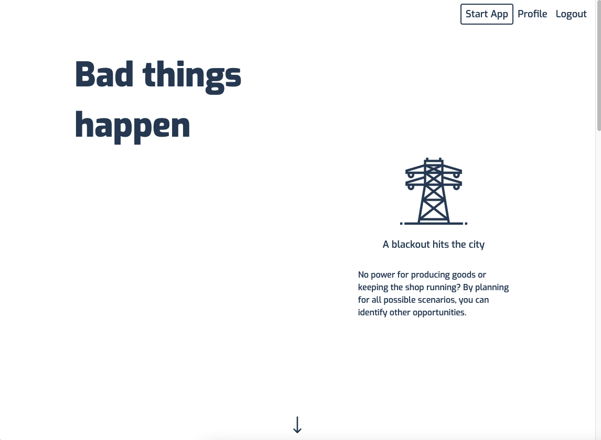
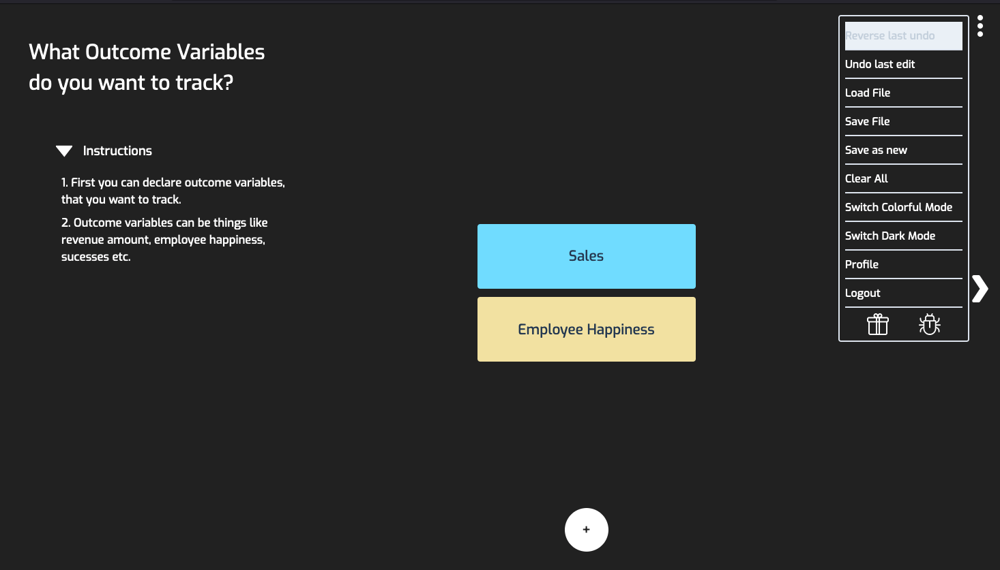
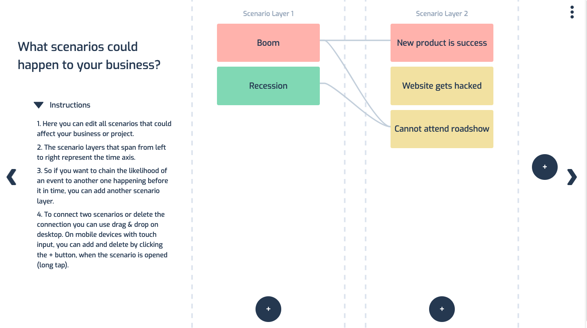
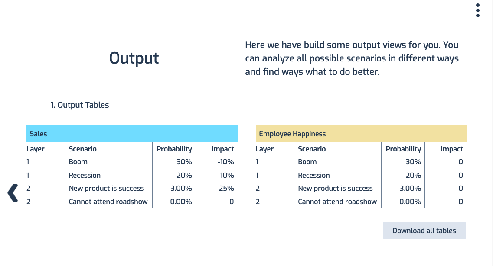
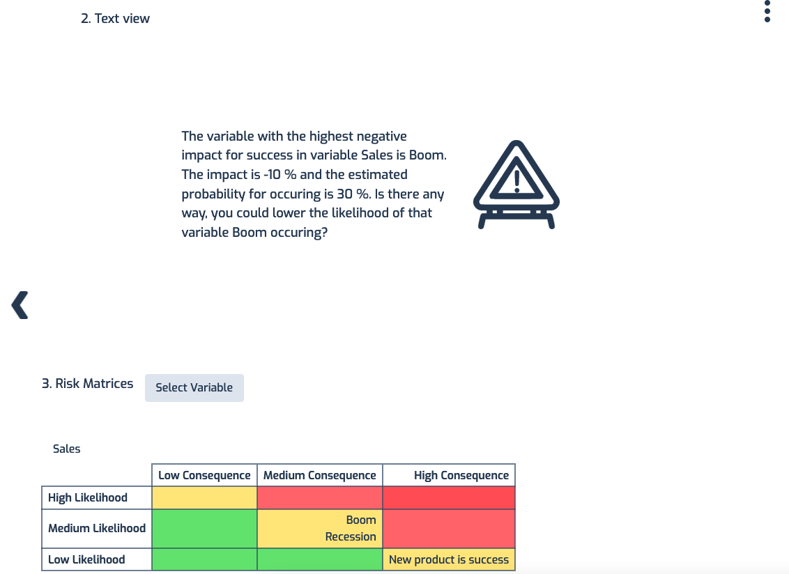
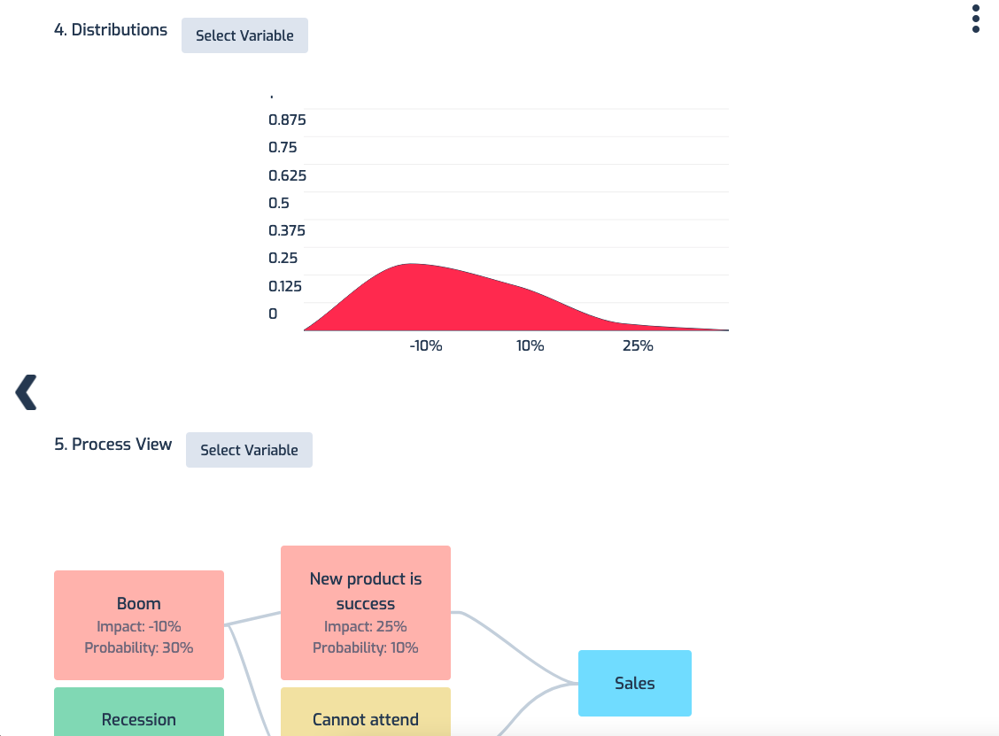

# Simply Scenario Plan - The Risk management app

Full implementation using Vue.js 2.

Also working combination of Google Firebase and Netlify Functions used here.

- All code is provided and free for use, learning and further development.

### Front Page

### The App

